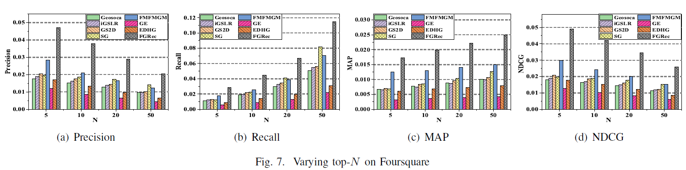
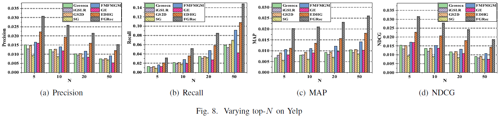

## FGRec

FGRec: A Fine-Grained Point-of-Interest Recommendation Framework by Capturing Intrinsic Influences (IJCNN 2020)

## Performance

```
Details for Precision:

| Dataset    | Precision@5 | Precision@10 | Precision@20   | Precision@50 |
| ---------- | ------------| -------------| ---------------| -------------|
| Foursquare | 0.04712     | 0.03772      | 0.02885        | 0.0204       |
| Yelp       | 0.030783    | 0.0258491    | 0.0214022      | 0.015348     |
```

```
Details for Recall:

| Dataset    | Recall@5    | Recall@10    | Recall@20      | Recall@50    |
| ---------- | ------------| -------------| ---------------| -------------|
| Foursquare | 0.02867     | 0.04446      | 0.06681        | 0.115        |
| Yelp       | 0.031421    | 0.05193      | 0.085184       | 0.1479221    |
```

```
Details for MAP:

| Dataset    | MAP@5        | MAP@10       | MAP@20         | MAP@50      |
| ---------- | ------------ | -------------| ---------------| ------------|
| Foursquare | 0.01733      | 0.01987      | 0.02219        | 0.02491     |
| Yelp       | 0.0202166    | 0.021        | 0.0231568      | 0.026059    |
```

```
Details for NDCG:

| Dataset    | NDCG@5       | NDCG@10      | NDCG@20        | NDCG@50      |
| ---------- | ------------ | -------------| ---------------| -------------|
| Foursquare | 0.04894      | 0.04192      | 0.03448        | 0.02585      |
| Yelp       | 0.03161      | 0.0279923    | 0.02425        | 0.0186004    |
```
- The performance of our framework on Foursquare.



- The performance of our framework on Yelp.



## Requirements

- python==3.7


## Datasets

We use two real-world LBSN datasets from Foursquare and Yep.
```
Statistics:

| Dataset    | Number of users | Number of POIs | Number of categories | Number of check-ins    | Number of social links  | User-POI matrix density|
| ---------- | --------------- | -------------- | ---------------------| ---------------------- |-------------------------|----------------------- |
| Foursquare | 2,551           | 13,474         | 10                   | 124,933                | 32,512                  |0.291%                  |
| Yelp       | 30,887          | 30,887         | 624                  | 860,888                | 860,888                 |0.14%                   |
```

## How to run FGRec model

```
1.python recommendation_Foursquare.py
2.recommendation_Yelp.py
```

## Citation
Please cite our paper if you use the code or datasets:
```
@inproceedings{su2020fgrec,
  title={FGRec: A Fine-Grained Point-of-Interest Recommendation Framework by Capturing Intrinsic Influences},
  author={Yijun Su, Jia-Dong Zhang, Xiang Li,  Daren Zha, Ji Xiang, Wei Tang and Neng Gao},
  booktitle={IEEE International Joint Conference on Neural Networks, {IJCNN} 2020}, 
  pages={1-9},
  doi={10.1109/IJCNN48605.2020.9207571},
  year={2020}
}
```
## Contact

If you have any questions, please contact us by suyijun.ucas@gmail.com, we will be happy to assist.

Last Update Date: October 1, 2021